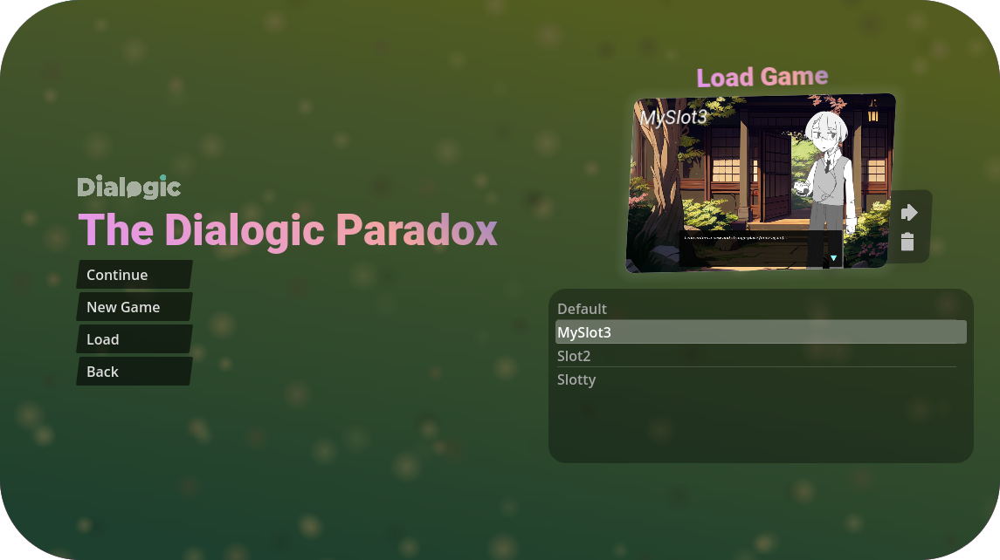
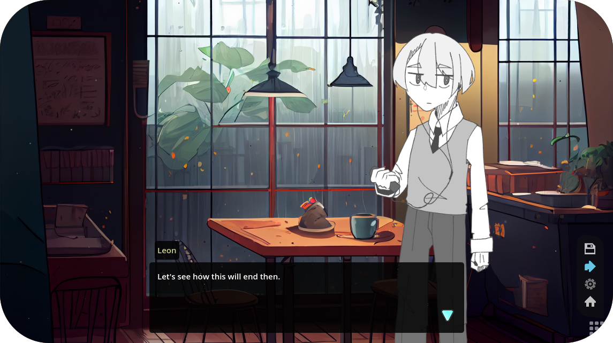
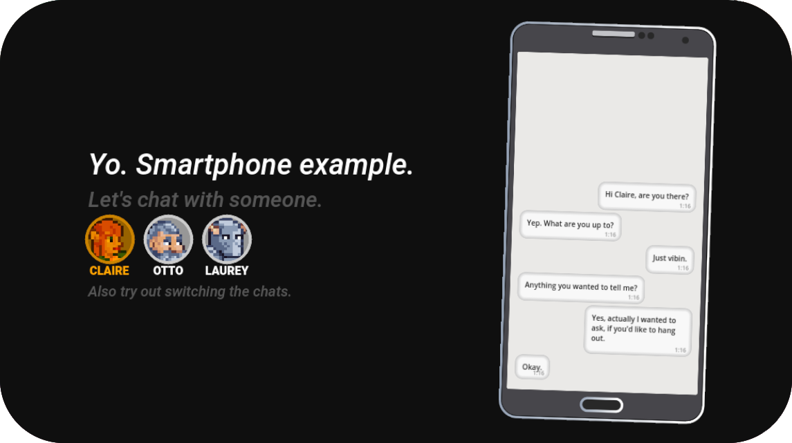
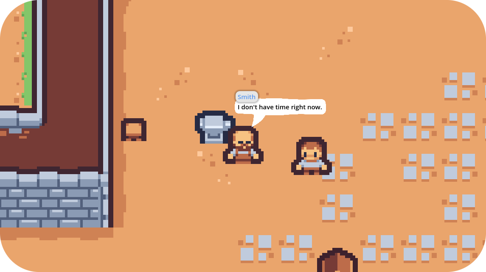
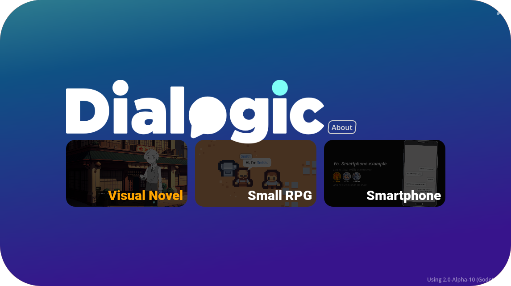

# Dialogic Test Project

The goal of this project is to have a lot of resources and timelines to test Dialogic.

The version of Dialogic should be the one in https://github.com/coppolaemilio/dialogic/tree/main.

Whenever a Dialogic release is made a tag should be created on this repository to know that up to this point every timeline and resource was working properly.

</img> </img> </img> </img> 

